# 📊 Olist Analytics — Python & Streamlit

[](https://www.python.org/)
[](https://pandas.pydata.org/)
[](https://plotly.com/)
[](https://streamlit.io/)

> **🔗 Dashboard Online:** [Acesse o dashboard](https://olistpython-tt22kbyks8xx4a8dmvyfcj.streamlit.app/)

Projeto de **Data Analytics** desenvolvido em Python e Streamlit a partir do conjunto de dados público da **Olist**, uma empresa brasileira de tecnologia voltada ao ecossistema de e-commerce.

O projeto transforma dados de pedidos, clientes, produtos, itens e pagamentos em indicadores e análises para apoiar a compreensão do desempenho comercial, da distribuição geográfica e da evolução da base de clientes.

A base reúne pedidos realizados entre **2016 e 2018**, permitindo analisar diferentes etapas da jornada de compra, desde o pedido até a entrega logística ao cliente.

---

## 🖼️ Preview

<details>
<summary><b>📊 Ver prints do Painel Executivo</b></summary>
<br>

<p align="center">
  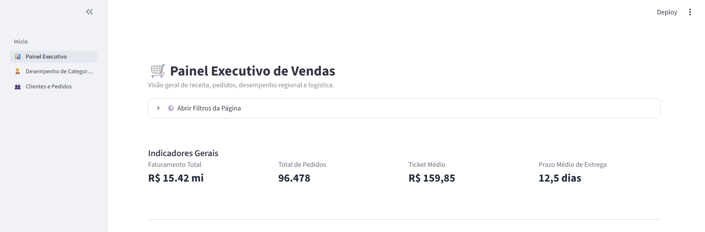
</p>

<p align="center">
  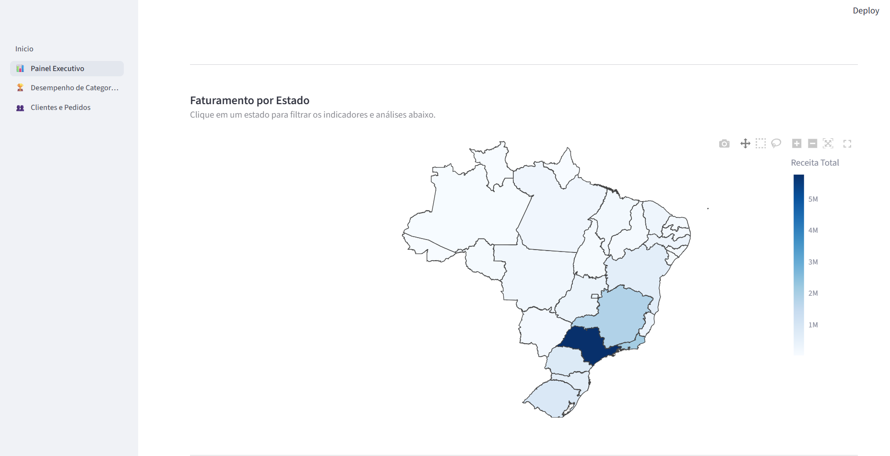
</p>

<p align="center">
  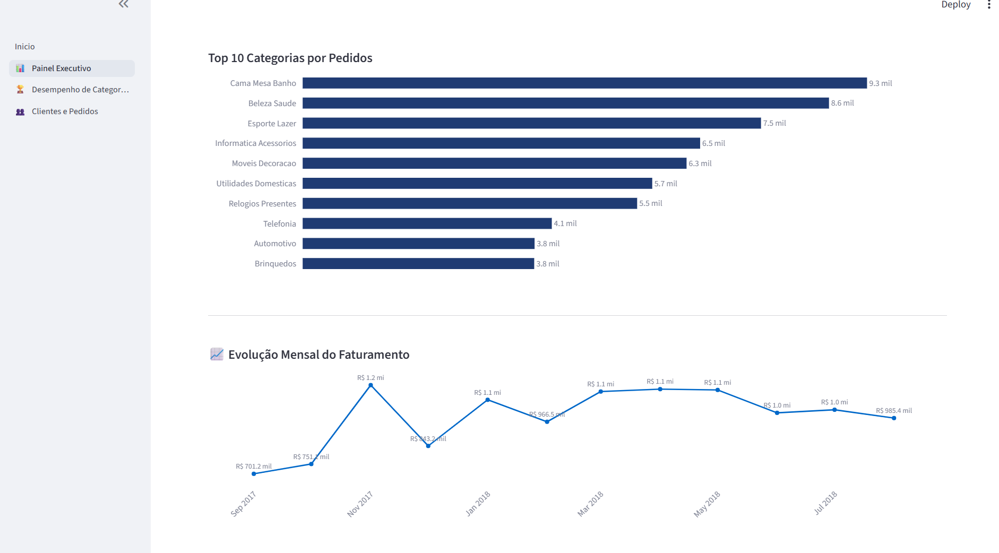
</p>

<p align="center">
  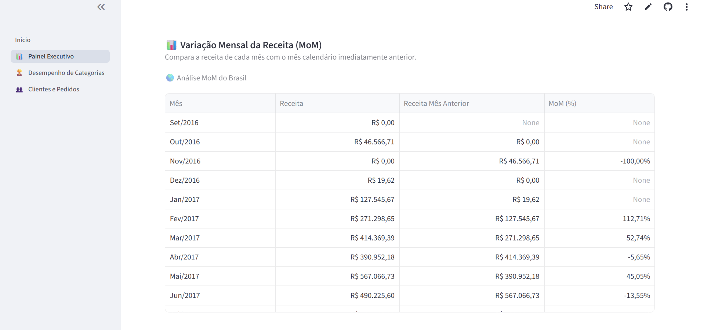
</p>

</details>

<details>
<summary><b>🏆 Ver prints de Desempenho das Categorias</b></summary>
<br>

<p align="center">
  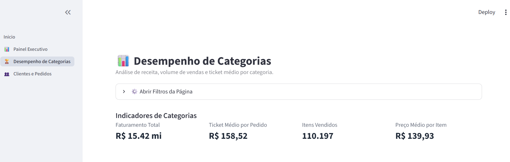
</p>

<p align="center">
  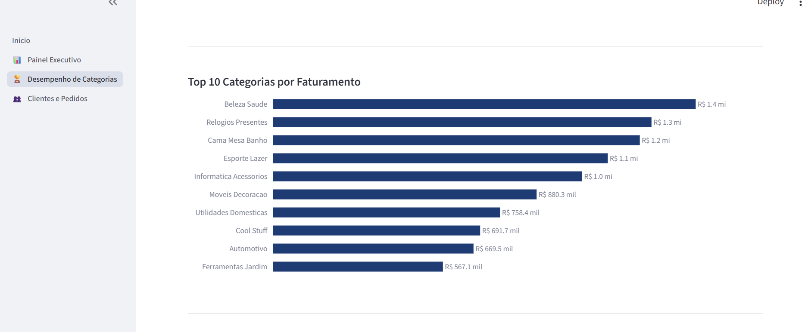
</p>

<p align="center">
  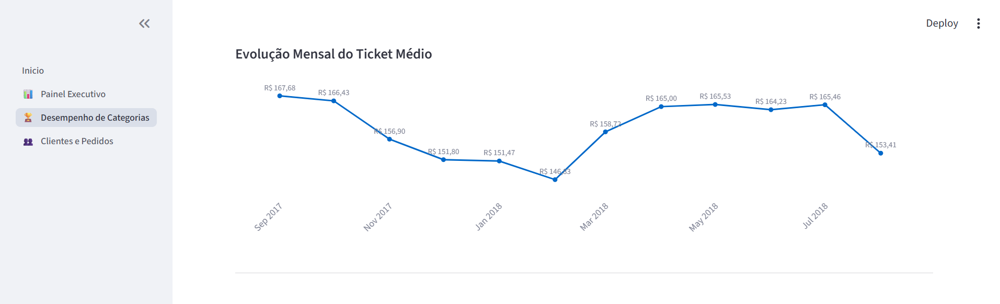
</p>

<p align="center">
  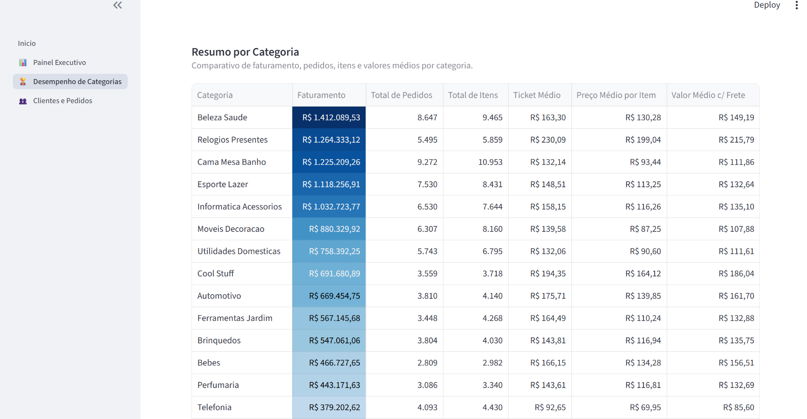
</p>

</details>

<details>
<summary><b>👥 Ver prints de Clientes e Pedidos</b></summary>
<br>

<p align="center">
  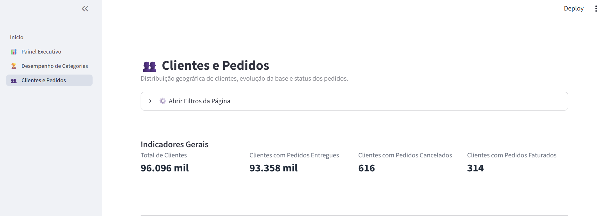
</p>

<p align="center">
  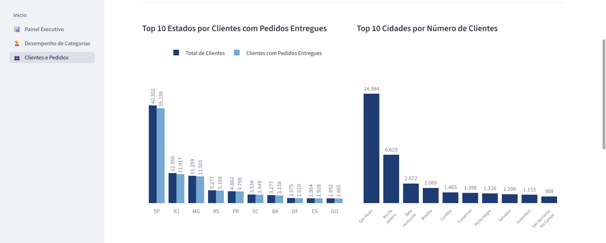
</p>

<p align="center">
  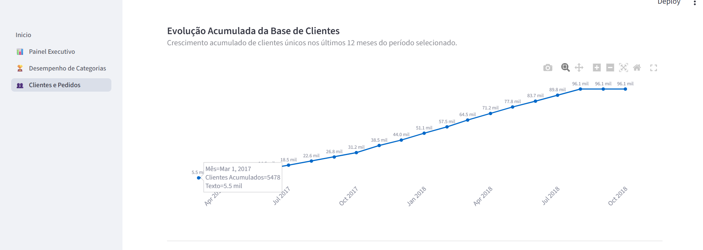
</p>

<p align="center">
  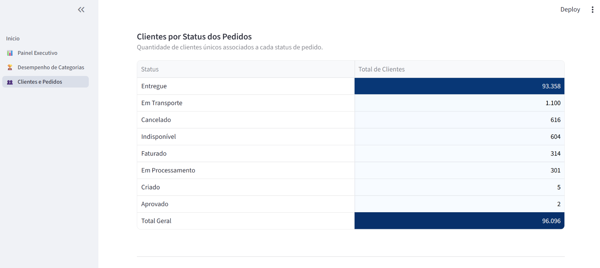
</p>

</details>

<!-- Se tiver um GIF de demonstração, descomente o bloco abaixo -->
<!--
<p align="center"></p>
-->

---

---

## 🎯 Objetivo

Transformar dados brutos em informações que permitam analisar:

- 📈 Evolução do faturamento e volume de pedidos;
- 💰 Ticket médio e prazo médio de entrega;
- 📦 Desempenho das categorias de produtos;
- 📍 Distribuição geográfica de vendas e clientes;
- 👥 Evolução da base de clientes;
- 🔎 Distribuição dos pedidos por status.

---

## 📊 Dashboard

O projeto está dividido em três visões principais.

### 1. 📊 Painel Executivo

Visão geral dos principais indicadores de desempenho do negócio.

**Principais métricas:**
- Faturamento total;
- Total de pedidos;
- Ticket médio;
- Prazo médio de entrega.

**Análises:**
- Mapa interativo de receita por estado;
- Evolução mensal do faturamento;
- Análise Month-over-Month (MoM);
- Ranking das principais categorias.

### 2. 🏆 Desempenho das Categorias

Análise do desempenho comercial das categorias de produtos.

**Principais métricas:**
- Faturamento;
- Ticket médio por pedido;
- Quantidade de itens vendidos;
- Preço médio por item.

**Análises:**
- Top 10 categorias por faturamento;
- Comparação de volume e receita entre categorias;
- Evolução mensal do ticket médio;
- Resumo consolidado por categoria.

### 3. 👥 Clientes e Pedidos

Análise da distribuição geográfica e evolução da base de clientes.

A identificação dos clientes utiliza `customer_unique_id`, permitindo contabilizar corretamente clientes únicos mesmo quando um mesmo cliente realizou múltiplos pedidos.

**Principais métricas:**
- Total de clientes únicos;
- Clientes com pedidos entregues;
- Clientes com pedidos cancelados;
- Clientes com pedidos faturados.

**Análises:**
- Top 10 estados por clientes;
- Top 10 cidades por clientes;
- Evolução acumulada da base de clientes;
- Distribuição de clientes por status dos pedidos.

> Um mesmo cliente pode aparecer em mais de um status caso tenha realizado pedidos com situações diferentes.

---

## 🚀 Como Executar Localmente

```bash
# 1. Clone o repositório
git clone https://github.com/Carlosarmendoca/olistpython.git
cd olistpython

# 2. Crie e ative um ambiente virtual (opcional, mas recomendado)
python -m venv venv
source venv/bin/activate      # Linux/Mac
venv\Scripts\activate         # Windows

# 3. Instale as dependências
pip install -r requirements.txt

# 4. Execute a aplicação
streamlit run Inicio.py
```

O dashboard abrirá automaticamente no navegador em `http://localhost:8501`.

---

## 🚀 Destaques Técnicos

### 🎨 Design Executivo
Interface desenvolvida com foco em **clareza visual, redução de ruídos e Data Storytelling**, utilizando uma identidade visual consistente entre as páginas.

### 🔎 Filtros Interativos
Os dashboards possuem filtros por **ano e estado**, permitindo explorar diferentes recortes da base de dados.

### 🗺️ Cross-Filtering Geográfico
O mapa interativo da visão executiva utiliza `st.session_state` para permitir a seleção de estados e atualização dinâmica das análises relacionadas.

### 🇧🇷 Formatação PT-BR
Valores monetários e quantitativos são apresentados seguindo o padrão brasileiro, incluindo formatação de moeda, milhares e números inteiros.

### ⚡ Performance
Utilização de `@st.cache_data` para evitar o recarregamento desnecessário dos dados e melhorar a performance da aplicação.

### 👥 Clientes Únicos
Utilização de `customer_unique_id` em análises de clientes para evitar a contagem duplicada de consumidores que realizaram múltiplos pedidos.

### 🧩 Organização do Código
As transformações e preparações das bases foram organizadas em funções reutilizáveis dentro da estrutura `views/`, separando a preparação dos dados da camada de apresentação dos dashboards.

---

| Tecnologia     | Utilização                                                             |
| -------------- | ---------------------------------------------------------------------- |
| **Python**     | Desenvolvimento da aplicação e tratamento dos dados                    |
| **Pandas**     | Manipulação, transformação, agrupamento e análise dos dados            |
| **NumPy**      | Operações e suporte ao processamento dos dados                         |
| **Plotly**     | Criação de gráficos e mapas interativos no dashboard                   |
| **Matplotlib** | Aplicação de gradientes de cores nas tabelas do dashboard              |
| **Streamlit**  | Desenvolvimento da interface e filtros interativos                     |
| **Git/GitHub** | Versionamento e documentação do projeto                                |
| **IA**         | Apoio na revisão de código, refatoração e boas práticas de organização |

---

## 🔎 Tratamento e Preparação dos Dados

Durante o desenvolvimento foram realizadas etapas de limpeza, transformação e preparação dos dados utilizando Pandas.

Principais tratamentos realizados:

- Conversão de campos para `datetime`;
- Tratamento de valores ausentes;
- Padronização dos nomes de cidades;
- Relacionamento entre diferentes bases utilizando `merge()`;
- Agrupamentos e agregações utilizando `groupby()`;
- Contagem de clientes únicos utilizando `nunique()`;
- Criação de métricas derivadas;
- Organização das transformações em funções reutilizáveis;
- Reutilização das bases para reduzir operações repetitivas.

---

## 📌 Principais Métricas

### Faturamento
Valor total associado aos pedidos considerados na análise.

### Ticket Médio
```
Ticket Médio = Faturamento Total / Total de Pedidos
```

### Clientes Únicos
Quantidade distinta de clientes identificados por `customer_unique_id`.

### Receita por Categoria
Permite comparar a contribuição das diferentes categorias para o faturamento total.

### Receita Mensal
Permite acompanhar a evolução do faturamento ao longo do período analisado.

### Evolução da Base de Clientes
A evolução acumulada considera cada cliente apenas uma vez e utiliza seu primeiro pedido identificado para determinar o período de entrada na base.

---

## 💡 Insights Possíveis

A estrutura dos dashboards permite explorar diferentes aspectos do negócio, como:

- Identificação das regiões com maior concentração de clientes e maior volume de vendas;
- Identificação das categorias com maior participação no faturamento;
- Comparação entre volume de pedidos, quantidade de itens e receita;
- Acompanhamento da evolução da base de clientes;
- Análise da distribuição de clientes entre diferentes status de pedidos;
- Comparação entre indicadores comerciais e operacionais.

---

## 🧠 Principais Aprendizados

O desenvolvimento deste projeto permitiu aplicar conceitos importantes de **Data Analytics**, incluindo:

- Exploração e tratamento de dados;
- Manipulação de DataFrames com Pandas;
- Relacionamento entre diferentes bases;
- Criação e validação de métricas de negócio;
- `groupby()` e agregações;
- `merge()` e relacionamento entre tabelas;
- `nunique()` para identificação de clientes únicos;
- Análise temporal;
- Criação de indicadores;
- Visualização de dados;
- Desenvolvimento de dashboards interativos;
- Organização de código em funções reutilizáveis;
- Versionamento utilizando Git e GitHub.

---

## 🚀 Próximos Passos

Como evolução do projeto, algumas possibilidades são:

- Evoluir o projeto para uma estrutura de **pipeline de dados**, automatizando as etapas de ingestão, tratamento e disponibilização dos dados;
- Centralizar funções de formatação e estilo (hoje replicadas entre as páginas) em um módulo `utils/` compartilhado;
- Aprofundar as análises realizadas no dashboard;
- Incluir novos indicadores de negócio;
- Explorar análises de comportamento e recorrência dos clientes;
- Aplicar os conhecimentos adquiridos nos estudos de Engenharia de Dados para evoluir a arquitetura do projeto.

---

## 📁 Estrutura do Projeto

```
olistpython/
│
├── assets/
│   ├── painel_executivo.png
│   ├── desempenho_categorias.png
│   └── analise_clientes.png
│
├── dados/
│   ├── pedidos_limpo.csv
│   ├── clientes_limpo.csv
│   ├── itens_limpo.csv
│   ├── pagamentos_limpo.csv
│   └── produtos_limpo.csv
│
├── Notebooks/
│   └── Análises e exploração dos dados
│
├── pages/
│   ├── 1_Painel_Executivo.py
│   ├── 2_Desempenho_Categorias.py
│   └── 3_Analise_Clientes.py
│
├── views/
│   └── Funções de preparação das bases
│
├── Inicio.py
├── requirements.txt
└── README.md
```

---

## 📌 Sobre o Projeto

Este projeto faz parte do meu portfólio de **Data Analytics** e tem como objetivo demonstrar, na prática, a aplicação de Python, Pandas e ferramentas de visualização em um problema de negócio.

Mais do que construir gráficos, o projeto busca demonstrar o processo de:

**Dados → Tratamento → Métricas → Análise → Visualização → Insights**

---

## 👤 Autor

**Carlos Alberto Rodrigues de Mendonça**

Projeto desenvolvido para composição de portfólio na área de **Data Analytics**.

🔗 [GitHub](https://github.com/Carlosarmendoca)